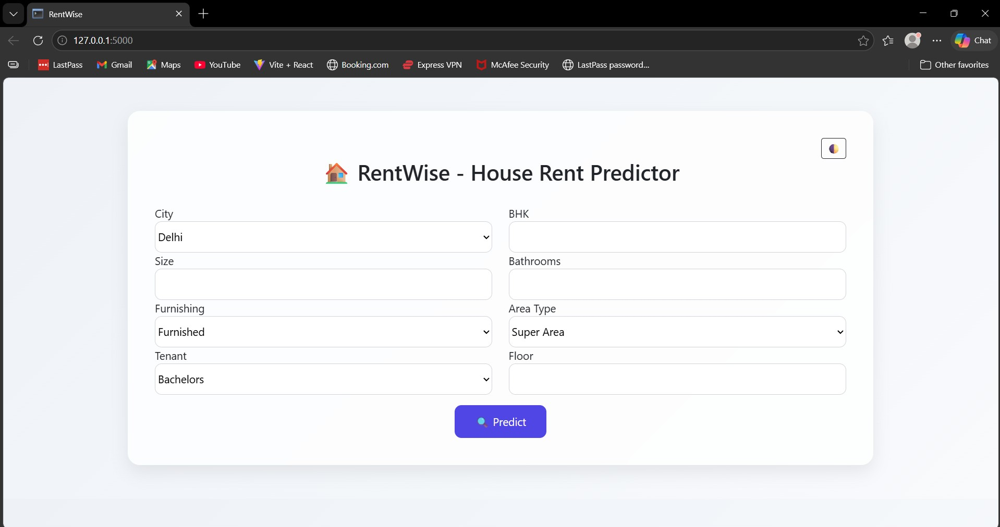
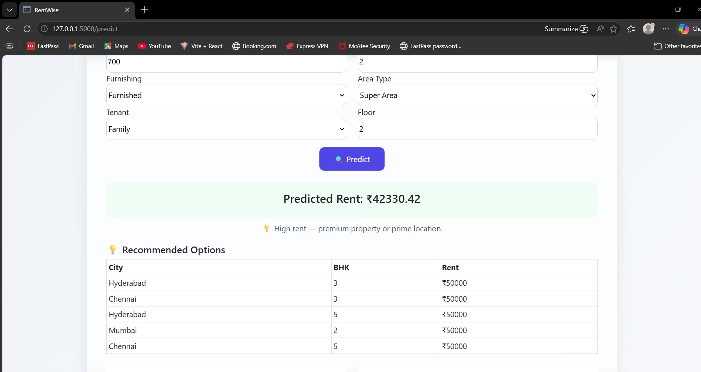
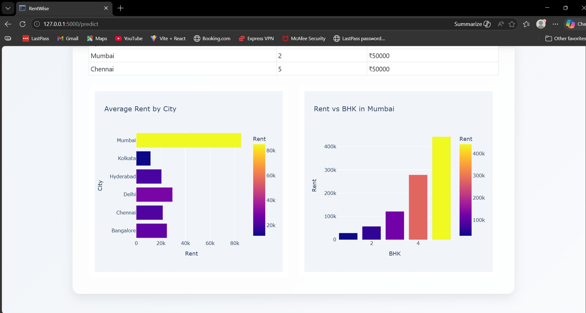
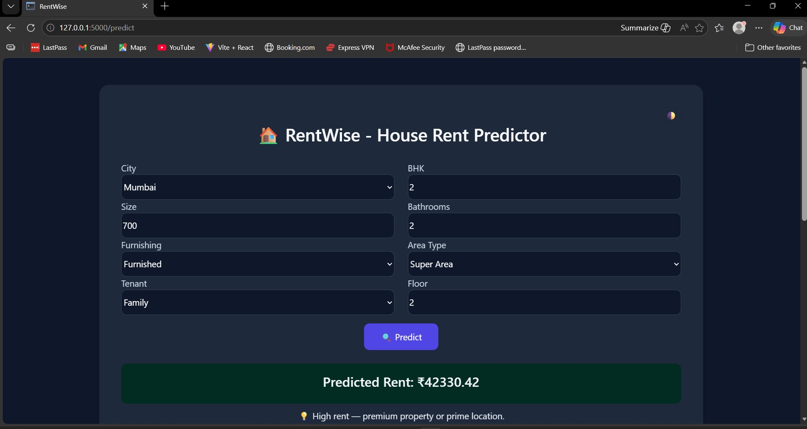

# RentWise: House Rent Predictor 🏠

RentWise is a Machine Learning-based web application that predicts house rent based on property features such as city, BHK, size, bathrooms, furnishing status, tenant type, area type, and floor level.

The application provides:
- Real-time rent prediction
- Graphical analysis
- Property recommendations
- Light & Dark mode support

---

## 🚀 Features

- 🔍 Real-time House Rent Prediction
- 📊 Interactive Graphical Analysis
- 🏙️ City-wise Rent Comparison
- 🛋️ Furnishing & Property Feature Analysis
- 💡 Recommendation System
- 🌙 Light & Dark Mode Support
- 📱 Responsive and User-Friendly Interface

---

## 🛠️ Technologies Used

- Python
- Flask
- Machine Learning
- Scikit-learn
- Pandas & NumPy
- Plotly
- HTML
- CSS
- Bootstrap

---

## 📂 Project Workflow

1. User enters property details  
2. Data is processed and validated  
3. Machine learning model predicts rent  
4. Results, graphs, and recommendations are displayed  

---

## 📸 Project Screenshots

### 🔹 Home Page



### 🔹 Prediction Result



### 🔹 Graphical Analysis



### 🔹 Dark Mode Interface



---

## ▶️ Run the Project

### Step 1: Install Dependencies

```bash
pip install -r requirements.txt
```

### Step 2: Run the Flask Application

```bash
python app.py
```

### Step 3: Open in Your Browser

```bash
http://127.0.0.1:5000/
```

---

## 📌 Future Improvements

- Real-time property data integration
- Advanced recommendation system
- Mobile responsive optimization
- Location-based analytics
- Deep learning model integration

---

## 👩‍💻 Author

**Anshika Yadav**
